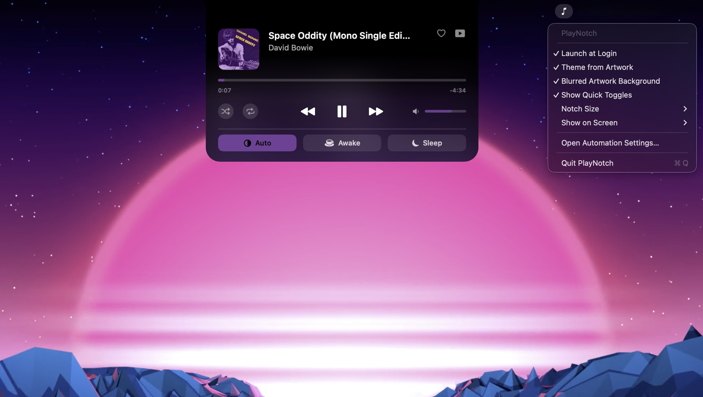

# PlayNotch

> Turn the MacBook notch into a music controller for **Apple Music**, **Spotify**
> and **YouTube Music** — hover to control, themed by your album art.



PlayNotch is a lightweight, background macOS app that turns the notch (or a small
strip at the top of any Mac) into an **interactive now-playing controller**.

Hover the notch and it expands into a card with artwork, title, artist, a
scrubbable **progress bar**, a **volume** slider, **shuffle / repeat / like**
toggles, and ⏮ previous · ⏯ play/pause · ⏭ next. The card is **tinted by the
album art** (optionally with a blurred-cover background), it **follows whichever
app you most recently started playing**, and a Control-Center-style row adds
quick system toggles. No Dock icon — everything lives in a menu-bar item.

Built with **SwiftPM, no Xcode**, controlling the players through AppleScript
(Music/Spotify) and injected JavaScript (YouTube Music) — no private APIs.

📖 **Read the story:** [How (and why) I built PlayNotch](https://mautoblog.com/en/posts/playnotch-macos-notch-music-controller-swift-2026/)

---

## Requirements

- **macOS 14** or later (tested on macOS 26).
- **Swift 6 toolchain** (Apple's Command Line Tools are enough — **Xcode is not
  required**). Check with:
  ```bash
  swift --version
  ```
  If missing, install the tools with `xcode-select --install`.

---

## Quick start

From the project folder:

```bash
./scripts/build_app.sh --run
```

This command:
1. builds in *release*,
2. creates the `build/PlayNotch.app` bundle,
3. kills any running instance and launches the app.

The notch appears at the top. **There is no Dock icon**: PlayNotch runs as a
background (agent) app.

### Other useful commands

```bash
swift build -c release      # just compile, without building the .app
./scripts/build_app.sh      # build the .app but don't launch it
```

### Menu-bar item

PlayNotch adds a small **♪ icon to the menu bar** — its home for settings,
since there's no Dock icon. From its menu you can:

- toggle **Launch at Login**,
- toggle **Theme from Artwork** and a **Blurred Artwork Background**,
- **Show Quick Toggles** (the Control Center row) on/off,
- pick the **Notch Size** (Compact / Default / Large),
- pick which display hosts the notch (**Show on Screen**),
- jump to the **Automation** privacy settings,
- **Quit** PlayNotch.

(You can also quit from the terminal with `pkill -f "PlayNotch.app/Contents/MacOS"`.)

---

## Installation (step by step)

1. **Get the code and build it.**
   ```bash
   git clone https://github.com/MatteoAdamo82/PlayNotch.git
   cd PlayNotch
   ./scripts/build_app.sh --run
   ```
   The notch widget appears at the top center of the screen.

2. **Start playing something** in Apple Music, Spotify, or YouTube Music and
   hover the notch — it expands into the now-playing card.

3. **Grant the Automation consent.** The first time PlayNotch sends a command to
   a player (e.g. when it reads what's playing or you press play/next), macOS
   shows a dialog like:

   > *"PlayNotch" wants access to control "Music.app". Allowing control will
   > provide access to documents and data in "Music", and to perform actions
   > within that app.*

   Click **OK**. macOS asks this once per controlled app (Music, Spotify, your
   browser). If nothing shows up in the card, it usually means a consent was
   denied — re-enable it (see below).

4. **For YouTube Music**, do the one-time browser setup in the section below.

5. *(Optional)* **Launch at login** — see the section further down.

### Re-enabling a denied consent

If you clicked *Don't Allow*, turn it back on under:

**System Settings → Privacy & Security → Automation** → expand **PlayNotch** and
enable Music / Spotify / your browser.

> **Note:** PlayNotch is **ad-hoc signed** (not notarized). The very first launch
> may need *System Settings → Privacy & Security → "Open Anyway"*, or a
> right-click → **Open** on `build/PlayNotch.app`.

---

## Permissions reference

PlayNotch reads and controls the players through system automation, so it needs
one **Automation** consent per controlled app. These are the standard macOS TCC
permissions and can always be reviewed in **System Settings → Privacy &
Security → Automation**.

| Player        | Consent needed                                    |
|---------------|---------------------------------------------------|
| Apple Music   | Automation → control **Music**                    |
| Spotify       | Automation → control **Spotify**                  |
| YouTube Music | Automation → control your **browser** (+ JS, below) |

### YouTube Music only

YT Music has no automation interface of its own, so PlayNotch drives the
**browser tab** where `music.youtube.com` is open. In addition to the Automation
consent, you must enable the **JavaScript from Apple Events** permission once:

- **Safari**: *Develop → "Allow JavaScript from Apple Events"* menu
  (if you don't see the Develop menu: *Settings → Advanced → "Show Develop
  menu"*).
- **Chrome / Brave / Edge / Arc**: *View → Developer → "Allow JavaScript from
  Apple Events"* menu.

Supported browsers for YT Music: Chrome, Brave, Edge, Arc, Safari.

---

## How it works

| App           | How it's read / controlled                            |
|---------------|--------------------------------------------------------|
| Apple Music   | AppleScript to `Music.app` (artwork included)          |
| Spotify       | AppleScript to `Spotify.app` (artwork via URL)         |
| YouTube Music | JavaScript injected into the browser tab               |

State is refreshed every second. The playback position advances smoothly
between polls via local interpolation, so the progress bar never stutters.

When several players are active at once, PlayNotch tracks playback transitions:
the source you **most recently started playing** takes control, it keeps control
while it plays, and pausing it hands off to whatever else is still playing.

---

## Features

- Hover-to-expand notch with collapsed strip and an expanded card, with the
  notch's top corners rounded like the real one.
- Now-playing artwork, title, artist, and source icon.
- Transport controls: previous / play-pause / next.
- **Scrubbable progress bar** with elapsed / remaining time. Hover to preview a
  seek position (highlighted) with a time bubble; drag to seek.
- **Volume control**: scroll over the notch or drag the slider. Changes persist
  (YouTube Music is driven through its own player API).
- **Shuffle / repeat** toggles (Apple Music & Spotify natively; YouTube Music
  via its player bar, language-independent).
- **Like / favorite** the current track (Apple Music `loved`, YouTube Music
  like; hidden for Spotify, whose AppleScript can't save to library).
- **Artwork theming**: a vibrant accent colour is extracted from the cover and
  applied to the card tint, progress and volume bars, and active toggles.
  Optionally show the **blurred cover as the card background**. With theming
  off, the card stays fully black like the notch.
- **Adjustable notch size** (Compact / Default / Large) — the whole card scales
  uniformly, contents included.
- **Click the artwork** to bring the source app to the front (YouTube Music
  focuses and un-minimizes its browser tab).
- **Idle clock**: when nothing is playing, the card shows a live time + date.
- **Control Center row** under the music controls: cycle the system appearance
  (Light / Dark / Auto), keep the Mac awake (`caffeinate`), and sleep the
  display.
- **Menu-bar item** for settings: launch at login, theming, pick which display
  hosts the notch (*Show on Screen*), quit.
- Click-through everywhere outside the visible notch shape (the desktop and
  windows underneath stay fully clickable).

---

## Project structure

```
Sources/PlayNotch/
  main.swift              agent app (.accessory, no Dock)
  AppDelegate.swift       startup + reacting to screen changes
  StatusItemController    menu-bar item: settings, launch at login, quit
  Media/
    NowPlaying.swift      data model + MediaSource protocol
    AppleScriptRunner     NSAppleScript helper (+ locale-tolerant number parse)
    AppleMusicSource      Music.app
    SpotifySource         Spotify.app
    YouTubeMusicSource    browser-tab control
    MediaController       picks the active source (last-played wins)
  Notch/
    NotchViewModel        state, polling, artwork loading, accent colour
    NotchView             SwiftUI UI: notch shape, card, controls
    NotchWindow           NSPanel above the menu bar, non-activating
    NotchController        screen geometry, mouse tracking, pass-through
    PassthroughHostingView  lets clicks pass through outside the notch
    ColorExtraction       vibrant accent colour from artwork
scripts/
  build_app.sh            builds and packages the .app
```

---

## Launch at login (optional)

Toggle **Launch at Login** from the menu-bar **♪** menu (it uses
`SMAppService`). Since the app is ad-hoc signed and run from `build/`, macOS may
refuse to register it from there — move `PlayNotch.app` to `/Applications` (or
sign it with your own Developer ID) for reliable login registration.

---

## Limitations & notes

- **YouTube Music** is driven by reading/clicking its web page (no public API),
  so a future YouTube Music redesign can break it, and it needs the one-time
  *Allow JavaScript from Apple Events* browser setting.
- The collapsed strip matches the **physical notch width**, which varies by Mac;
  on Macs without a notch it falls back to a tidy strip at the top center.
- The app is **ad-hoc signed**, not notarized — the first launch may need
  *right-click → Open* or *Privacy & Security → Open Anyway*.
- State is polled once per second via AppleScript; impact is negligible, but
  it's not event-driven.

---

## License

[MIT](LICENSE) © 2026 Matteo Adamo.

---

## Roadmap

- [x] Progress bar + seek + volume control
- [x] Like / favorite and shuffle / repeat toggles
- [x] Artwork-based theming
- [x] Menu-bar item with launch at login + screen picker
- [x] Blurred-artwork background and "liquid" animations
- [x] Preferences (notch size, quick-toggles, screen, theming)
- [x] Control Center row (appearance, keep-awake, sleep)
```
